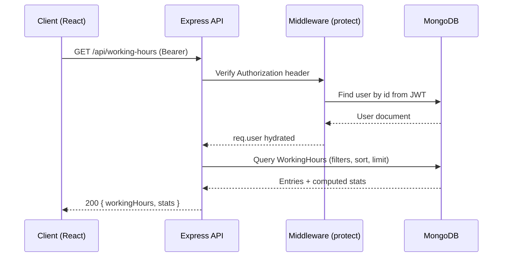
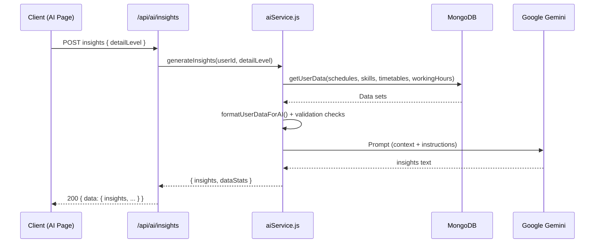

# HustleX — Capstone Project Report

Author: ashparshp  
Date: 17 Nov 2025

## Abstract

HustleX is a productivity and learning tracker that unifies daily working hours, skill progression, schedules, and weekly timetables, then layers AI-driven insights on top. The system provides: (1) structured data capture for time and tasks, (2) visualizations and stats, and (3) AI insights, recommendations, and reports using Google Gemini, enabling users to identify patterns, correct inconsistencies, and plan actionable next steps.

## Problem Statement

Knowledge workers juggle planning tools (calendars, to-do lists) with learning trackers and time logs, but these remain siloed. Without consolidation and analysis, users miss trends such as stalled skills, ineffective time blocks, or declining completion rates. HustleX solves this by integrating working-hours tracking, skill pipelines, daily schedules, weekly timetables, and AI analytics into one end-to-end workflow.

## Objectives

- Consolidate daily working hours, skill progress, schedules, and weekly timetables.
- Provide clean UI and filters to capture data quickly and review trends.
- Offer AI insights, recommendations, chat Q&A, and weekly reports based on user data.
- Ensure secure, scalable, and maintainable architecture with JWT auth, rate limiting, and input hardening.
- Enable category management across modules to align activities with goals.

## Tech Stack

- Frontend: React (Vite), React Router, TailwindCSS, Framer Motion, Recharts/Victory, Headless UI
- Backend: Node.js (Express), Mongoose (MongoDB)
- AI: Google Gemini via `@google/genai`
- Auth/Security: JWT (httpOnly cookie + Bearer), Helmet, XSS Clean, HPP, Rate Limit, CORS
- Tooling: ESLint, Nodemon, Vercel (client), Node 20.x

## System Architecture

```mermaid
flowchart LR
  subgraph Client [Client (Vite/React)]
    UI[Pages & Components]
    Ctx[Contexts & Hooks]
  end

  subgraph Server [Express API]
    Auth[Auth & Middleware]
    Cntrl[Controllers]
    Svc[Services]
    Models[(Mongoose Models)]
  end

  subgraph External
    Gemini[Google Gemini]
    SMTP[SMTP (Gmail)]
  end

  UI -->|fetch /api| Server
  Ctx -->|apiClient (Bearer+Cookie)| Server
  Server --> Models
  Svc --> Gemini
  Auth --> SMTP
  Models <--> MongoDB[(MongoDB)]
```

### Deployment & Environments

- Server `server.js` exposes `/api/*` on `PORT` (default 8080), Node 20.x.
- Client built with Vite; `vercel.json` rewrites to `index.html` for SPA routing.
- CORS allows origins from `CLIENT_URLS`.
- Required env vars include `MONGODB_URI`, `JWT_SECRET`, `JWT_EXPIRE`, `JWT_COOKIE_EXPIRE`, `GEMINI_API_KEY`, `SMTP_EMAIL`, `SMTP_PASSWORD`, `FROM_NAME`.

## Data Model

```mermaid
classDiagram
  class User {
    String name
    String email
    String phoneNumber
    String password (hashed)
    Boolean isEmailVerified
    Boolean isPhoneVerified
    String emailVerificationToken
    Date emailVerificationExpire
    String resetPasswordToken
    Date resetPasswordExpire
    String phoneVerificationCode
    Date phoneVerificationExpire
  }

  class Category {
    ObjectId user
    String name
    String type [working-hours|skills|schedule|timetable]
    String color
    String icon
    String description
  }

  class WorkingHours {
    ObjectId user
    Date date
    Number targetHours
    Number achievedHours
    String category
    String notes
    String mood [Productive|Normal|Distracted]
    virtual Number progressPercentage
    virtual String status
  }

  class Skill {
    ObjectId user
    String category
    String name
    String status [upcoming|in-progress|completed]
    Date startDate
    Date completionDate
    Number progress [0..100]
    String description
    Resource[] resources
    String priority [high|medium|low]
    Number orderIndex
  }
  class Resource {
    String title
    String url
    String type [course|documentation|tutorial|video|book|other]
  }

  class ScheduleItem {
    String title
    String description
    String startTime
    String endTime
    String category
    String priority [High|Medium|Low]
    Boolean completed
    String notes
  }

  class Schedule {
    ObjectId user
    Date date
    String dayType [Weekday|Weekend]
    ScheduleItem[] items
    Number totalHours (derived)
    String status [Planned|In Progress|Completed]
  }

  class Activity {
    String name
    String time
    String category
  }
  class DailyProgress {
    Activity activity
    Boolean[7] dailyStatus
    Number completionRate
  }
  class Week {
    Date weekStartDate
    Date weekEndDate
    DailyProgress[] activities
    Number overallCompletionRate
    String notes
  }
  class Timetable {
    ObjectId user
    String name
    String description
    Boolean isActive
    Week currentWeek
    Week[] history
    Activity[] defaultActivities
  }

  Category --> User
  WorkingHours --> User
  Skill --> User
  Schedule --> User
  Timetable --> User
```



## API Overview

All endpoints are prefixed with `/api`. Auth via Bearer token or httpOnly cookie; protected routes require `Authorization: Bearer <token>`.

### Auth (`/api/auth`)

- `POST /register` — Create user, sends email and optional phone verification; returns JWT + user.
- `POST /login` — Authenticate; returns JWT + user.
- `GET /logout` — Clears cookie.
- `GET /me` — Current user profile (protected).
- `PUT /update-details` — Update name/phone (re-sends phone code) (protected).
- `PUT /update-password` — Change password (protected).
- `POST /forgot-password` — Email reset link.
- `PUT /reset-password/:token` — Reset password.
- `GET /verify-email/:token` — Verify email (HTML response).
- `POST /verify-phone` — Verify phone via code (protected).
- `POST /resend-verification` — Resend email (protected).
- `POST /resend-phone-verification` — Resend phone code (protected).

### Categories (`/api/categories`) [protected]

- `GET /?type=working-hours|skills|schedule|timetable` — List user categories.
- `POST /` — Create category.
- `PUT /:id` — Update category.
- `DELETE /:id` — Delete category.
- `GET /defaults/:type` — Get default seed categories.

### Working Hours (`/api/working-hours`) [protected]

- `GET /?startDate&endDate&category` — List entries + returns `stats` aggregate.
- `POST /` — Upsert by `date`; fields: `date, targetHours, achievedHours, category, notes, mood`.
- `PUT /:id` — Update entry.
- `DELETE /:id` — Remove entry.
- `GET /stats` — Aggregate stats for period.
- `GET /categories` — Distinct categories including user-defined.

### Skills (`/api/skills`) [protected]

- `GET /?category&status` — List + grouped.
- `POST /` — Add skill; auto-sets `orderIndex`; sets dates on status transitions.
- `PUT /:id` — Update with duplicate guards; handles status transitions.
- `DELETE /:id` — Delete and compact `orderIndex` in category.
- `GET /categories` — Distinct categories (used + user-defined).
- `GET /stats` — Counts, completion rate, averages.
- `POST /reorder` — Bulk reorder by `[{id, orderIndex}]`.

### Schedule (`/api/schedules`) [protected]

- `GET /?startDate&endDate&status` — List schedules.
- `POST /` — Create schedule per date; `dayType` derived (Weekday/Weekend).
- `GET /:id` — Get schedule.
- `PUT /:id` — Update fields or items.
- `DELETE /:id` — Delete schedule.
- `POST /:id/items` — Add item (`title,startTime,endTime,category`).
- `PUT /:id/items/:itemId` — Update item.
- `DELETE /:id/items/:itemId` — Remove item.
- `GET /categories` — Categories from items + user-defined.

### Timetable (`/api/timetables`) [protected]

- `GET /` — List timetables with summary.
- `POST /` — Create timetable; initializes `currentWeek` via `startNewWeek()`.
- `GET /:id` — Get full timetable.
- `PUT /:id` — Update metadata and active flag (enforces single active timetable).
- `DELETE /:id` — Delete (prevents deleting sole timetable).
- `GET /:id/current-week` — Returns current week; rotates week if ended.
- `GET /:id/history?page&limit` — Paginated history.
- `POST /:id/toggle` — Toggle an activity’s daily status by index.
- `PUT /:id/activities` — Replace default activities; preserves existing week status when names/times match.
- `GET /:id/stats` — Category breakdown + overall trends.
- `POST /:id/new-week` — Force-start a new week.
- `GET /categories` — Distinct categories from defaults + user-defined.

### AI (`/api/ai`) [protected]

- `POST /insights` — Returns structured insights plus data stats; accepts `detailLevel` (brief|detailed|comprehensive).
- `POST /recommendations` — 5–7 data-backed recommendations; optional `focusArea`.
- `POST /query` — Natural-language Q&A over user data with date range parsing.
- `POST /chat` — Convenience endpoint mapping to `query`.
- `POST /schedule-suggestions` — 3–5 next-week schedule templates.
- `POST /skill-analysis` — Assessment, learning path, time allocation, gaps, milestones.
- `POST /weekly-report` — Period report with summary, achievements, time analysis, next-week plan.

## Frontend Architecture

- Routing (`App.jsx`): protected routes for Working Hours, Skills, Timetable, Schedule, AI; public auth routes; landing pages.
- State: `AuthContext` (JWT lifecycle, profile, verification flows), `ThemeContext`.
- Data access: `apiClient` wraps fetch with base URL, auth headers, credentials, idempotent GET de-dupe, error normalization.
- Pages: `WorkingHoursPage`, `SkillsPage`, `SchedulePage`, `TimetablePage`, `AIPage`.
- Hooks: `useWorkingHours`, `useSkills`, `useSchedules`, `useTimetable`, `useCategories`, `useAI`.
- Components: statistics cards, charts (Recharts/Victory/Sparklines), filters, category manager, AI Insights/Recommendations/Chat UI.

## Security & Hardening

- Helmet, XSS Clean, HPP, Rate Limiting (100/10min on `/api/auth`).
- CORS allowlist via `CLIENT_URLS`; credentials enabled.
- JWT in cookie + Bearer; `protect` middleware verifies token and loads user.
- Unique indexes to prevent duplicates (e.g., schedule per day, skills by category/name, categories per type).
- Input validation and guards in controllers; safe error handling.

## Key Implementation Details

- Schedules compute `totalHours` from `startTime`/`endTime`; status derived from completion ratio.
- WorkingHours exposes virtuals `progressPercentage` and `status`.
- Timetable `startNewWeek()` rolls current week into history and creates a fresh week aligned to Mon–Sun, preserving metrics; pre-save hooks compute per-activity and weekly completion.
- Skills auto-date transitions (start/completion) and ordering logic with compacting on delete.
- AI service composes a normalized textual context from all modules, adds consistency checks (e.g., completion discrepancies), and prompts Gemini for insight generation.

## Testing Strategy (Current & Next)

- Current: manual verification via UI and sample data scripts (`scripts/*`), health check `/api/health`.
- Next: add API integration tests (Jest + Supertest), component tests (React Testing Library), and schema-level tests for model invariants.

## Setup & Run

Prerequisites: Node 20.x, MongoDB, Google Gemini API key, SMTP creds for Gmail.

1. Backend

```
cd server
cp .env.example .env   # create and fill values if not present
npm install
npm run dev
```

Environment essentials:

- `PORT=8080`
- `MONGODB_URI=mongodb+srv://...`
- `JWT_SECRET=...`
- `JWT_EXPIRE=30d`
- `JWT_COOKIE_EXPIRE=30`
- `CLIENT_URLS=http://localhost:5173`
- `GEMINI_API_KEY=...`
- `SMTP_EMAIL=...` `SMTP_PASSWORD=...` `FROM_NAME=HustleX`

2. Frontend

```
cd client
cp .env.example .env   # set VITE_API_URL to http://localhost:8080
npm install
npm run dev
```

Key env:

- `VITE_API_URL=http://localhost:8080`

## Results & Discussion

HustleX delivers a cohesive workflow: plan with schedules/timetables, track working hours, organize skills, and receive AI insights that reference actual data. Data consistency checks surface mismatches (e.g., timetable vs. working hours completion), guiding corrective action. The modular controllers and Mongoose models keep complexity manageable and evolvable.

## Limitations

- AI output quality depends on the richness and cleanliness of user data.
- No offline mode; requires server access.
- Email/SMS providers are assumed available; current SMS utility is a stub.

## Future Work

- Add recurring schedule templates and calendar integrations (Google Calendar).
- Introduce offline-first caching and background sync.
- Expand AI to proactive nudges, anomaly detection, and goal alignment.
- Role-based sharing of timetables/schedules for team use.
- Automated data seeding and demo mode for first-time users.

## Executive Summary

- **Unified Workflow:** Working Hours, Skills, Schedule, and Timetable unify planning, execution, and reflection, amplified by AI insights (Gemini).
- **Secure API:** JWT + hardened middleware (Helmet, XSS Clean, HPP, Rate Limits) and unique DB constraints reduce misuse and duplication.
- **AI Value:** Insights, Recommendations, Q&A, and Weekly Reports cite actual user data, highlighting discrepancies and trends to drive action.
- **Scalable Design:** Clear model boundaries, indexes, lean queries, and stateless routes; client uses idempotent GET de-dupe and auth-aware fetch.
- **Next Steps:** Formal tests, observability, caching, prompt guardrails, and calendar integrations to elevate reliability and adoption.

## Requirements

### Functional Requirements

- User Authentication: register, login, logout, password reset, email/phone verification.
- Categories: CRUD per module (working-hours, skills, schedule, timetable) + defaults.
- Working Hours: CRUD, date-range filters, stats, category and mood breakdowns.
- Skills: CRUD with statuses, ordering, resources, stats, and reordering.
- Schedule: Daily plan CRUD, item-level CRUD, total hours, status derivation.
- Timetable: Weekly repeating plan with current week, history, toggles, and stats.
- AI: Insights, recommendations, weekly reports, schedule suggestions, skill analysis, and data Q&A.

### Non-Functional Requirements

- Performance: p95 API latency < 300ms for CRUD reads at typical loads; p95 AI responses < 6s.
- Availability: 99.5% monthly target for API; graceful degradation if AI quota exceeded.
- Security: JWT integrity, origin-restricted CORS, sanitized inputs, rate-limited auth.
- Privacy: Never log PII in plaintext; redact tokens; configurable retention.
- Accessibility: Keyboard navigation and color contrast for dark/light themes.
- Observability: Structured logs, request IDs, error categorization.

## Detailed Design

### Request Lifecycle (Protected Route)



### AI Insights Flow



### Deployment Topology

```mermaid
flowchart TB
  subgraph Web
    Vercel[Client (Vercel)]
  end
  subgraph App
    Node[Express Server]
    Mongo[(MongoDB Atlas)]
  end
  subgraph External
    Gemini[Google Gemini]
    SMTP[Gmail SMTP]
  end

  Browser --> Vercel
  Vercel -->|/api/*| Node
  Node --> Mongo
  Node --> Gemini
  Node --> SMTP
```

## Environment Variables

- Server
  - `PORT`: API port (default 8080)
  - `MONGODB_URI`: MongoDB connection string
  - `JWT_SECRET`: Secret for signing JWT
  - `JWT_EXPIRE`: Token lifetime (e.g., 30d)
  - `JWT_COOKIE_EXPIRE`: Cookie lifetime in days
  - `CLIENT_URLS`: Comma-separated allowed origins
  - `GEMINI_API_KEY`: Google Gemini API key
  - `SMTP_EMAIL`, `SMTP_PASSWORD`, `FROM_NAME`: email transport settings
- Client
  - `VITE_API_URL`: Base URL for API (e.g., http://localhost:8080)

## API Design Details

### Standard Error Shape

```json
{
  "success": false,
  "message": "Human-readable error",
  "stack": "<development only>"
}
```

### AI Quota Handling

- aiService normalizes quota/429 errors to:  
  `{ name: "QuotaExceededError", status: 429, message: "AI quota exceeded...", retryAfter? }`
- Clients should surface a friendly retry message and optionally backoff.

### Pagination & Limits

- History endpoints support `page` and `limit`.
- General list endpoints may apply server-side `limit` and sort for safety.

## Security & Threat Model

### Threats & Mitigations

- Token theft: use httpOnly cookie options in production, short-lived JWTs; avoid exposing tokens in logs.
- Brute force login: rate limit on `/api/auth`; add per-IP + per-account counters as enhancement.
- XSS/Injection: `xss-clean`, strict JSON parsing, avoid eval; validate inputs.
- CORS abuse: explicit allowlist from `CLIENT_URLS`, credentials gated.
- Data tampering: model-level unique indexes, ID scoping `user: req.user.id`.
- Email verification phishing: limited token lifetime, hashed tokens in DB.

### Data Retention & Privacy

- Store minimal PII (name, email, optional phone).
- Never store AI prompts containing secrets; redact where possible.
- Users can request deletion (cascade delete user-owned data).

## Performance & Scalability

- MongoDB Indexes: compound uniqueness (e.g., schedule per day, skills by user/name/category), faster lookups.
- Lean Reads: `.lean()` in AI data aggregation to reduce overhead.
- Batching: `Promise.all` for AI context fetch.
- Future: response caching for AI summaries; ETag/If-None-Match for GETs; Redis for hot aggregates.

## Monitoring & Logging

- Current: `morgan("dev")`.
- Next: Winston/Pino structured logs, per-request IDs, error categories, and Sentry integration for client + server.
- Health: `/api/health` endpoint for uptime checks.

## Testing Strategy & Plan

- Unit: model methods (virtuals, hooks, status derivation), utilities (JWT, email).
- Integration: auth flow, CRUD routes with protect middleware, AI 429 normalization.
- Component (client): forms, filters, charts conditional rendering.
- E2E: happy path for Working Hours → AI Insights loop.
- Tooling: Jest + Supertest (server), React Testing Library + Vitest (client).

## Accessibility & UX

- High-contrast themes, motion reduced where appropriate, semantic headings, focus states.
- Keyboard navigable modals and forms; validation messages visible to screen readers.

## AI System Details

- Prompt Templates: `detailLevel` variants (brief/detailed/comprehensive) enforce section structure and data citation.
- Consistency Checks: detects completion discrepancies, stalled skills, unmarked completes.
- Failure Modes: quota exceeded (429), empty data, long responses; provide fallback messages.
- Guardrails (next): schema-enforced outputs (JSON), length controls, retries with shorter prompts.

## Roadmap (Next 90 Days)

- 0–30 Days: API tests, structured logging, input validators (Zod/Joi), UI polish.
- 31–60 Days: Redis caching, Postman collection, CI pipeline with coverage gates.
- 61–90 Days: Calendar integration, role-based sharing, proactive AI nudges, performance tuning.

## Contribution & Maintenance

- Code Style: Prettier/ESLint, small focused PRs, keep controllers skinny, services cohesive.
- Branching: `main` protected; feature branches with PR review.
- Docs: update `docs/HustleX-Capstone-Report.md` and API examples on route changes.

## Sample API Usage

### cURL

```bash
# Auth: login
curl -s -X POST "$API/api/auth/login" \
  -H 'Content-Type: application/json' \
  -d '{"email":"user@example.com","password":"secret"}'

# Get working hours (Bearer)
curl -s "$API/api/working-hours?startDate=2025-11-01&endDate=2025-11-17" \
  -H "Authorization: Bearer $TOKEN"

# AI insights (detailed)
curl -s -X POST "$API/api/ai/insights" \
  -H "Authorization: Bearer $TOKEN" \
  -H 'Content-Type: application/json' \
  -d '{"detailLevel":"comprehensive"}'
```

### fetch (client pattern)

```js
await apiClient.post("/ai/query", { question: "Trend last 2 weeks?" });
```

## Appendix A — Endpoint Matrix

- Health: `GET /api/health`
- Auth: register, login, logout, me, update-details, update-password, forgot-password, reset-password, verify-email, verify-phone, resend-verification, resend-phone-verification
- Categories: list/create/update/delete/defaults
- Working Hours: CRUD, stats, categories
- Skills: CRUD, categories, stats, reorder
- Schedule: CRUD, item CRUD, categories
- Timetable: CRUD, current-week, history, toggle, activities update, stats, new-week, categories
- AI: insights, recommendations, query, chat, schedule-suggestions, skill-analysis, weekly-report

Postman assets:

- Collection: `docs/HustleX.postman_collection.json`
- Environment: `docs/HustleX.postman_environment.json`

## Appendix B — Selected Files

- Backend: `server.js`, `controllers/*`, `models/*`, `routes/*`, `services/aiService.js`, `middleware/auth.js`, `utils/*`
- Frontend: `src/pages/*`, `src/context/*`, `src/hooks/*`, `src/components/*`, `src/utils/apiClient.js`
